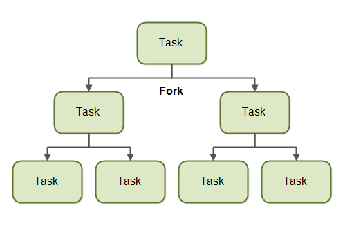
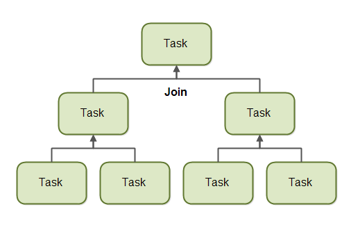
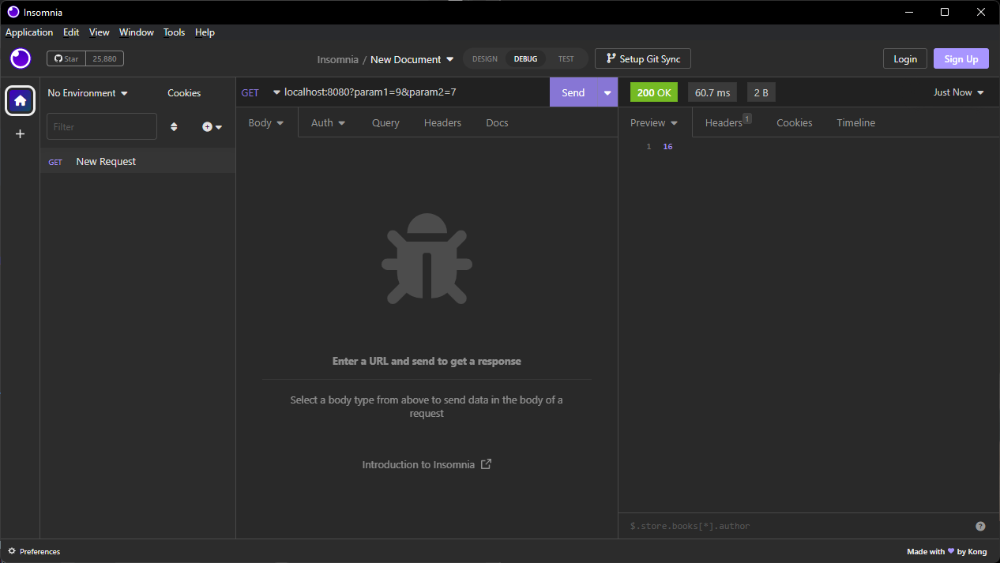

# Java 00
## 2.1. Basic
### Log Level
|Level|Nội dung|
|--|--|
|`FATAL`|Chỉ định các sự kiện lỗi rất nghiêm trọng có thể khiến ứng dụng bị hủy bỏ hoặc dừng lại.|
|`ERROR`|Chỉ định các sự kiện lỗi có thể xảy ra mà vẫn cho phép ứng dụng tiếp tục chạy.|
|`WARN`|Chỉ định các tình hướng có thể gây hại cho ứng dụng đang chạy.|
|`INFO`|Chỉ định các thông báo cung cấp thông tin làm nổi bật tiến trình của ứng dụng ở cấp độ chi tiết.|
|`DEBUG`|Chỉ định các sự kiện thông tin chi tiết hữu ích để gỡ lỗi ứng dụng.|
|`TRACE`|Chỉ định các sự kiện thông tin chi tiết hơn cấp độ `DEBUG`.|

### [Logging Sample](vertx-sample)

### [Log Configuration Optimize](log-config.xml)

## 2.2. Threading
### 2.2.1. Khái niệm thread-safe là gì?
Thread Safe là một khái niệm trong lập trình máy tính khi áp dụng Multi-threaded code. Thread Safe chỉ đến các thao tác trên dữ liệu được chia sẻ mà nó sẽ đảm bảo được việc truy cập, viết… đảm bảo đúng các thiết kế và ý tưởng của lập trình viên, nó sẽ không xảy ra vấn đề tương tác ngoài ý muốn.

Thường khi nói đến các thao tác của đối tượng, những thuật toán có hỗ trợ thread-safe thì hiểu đơn giản là có thể sử dụng trong multithreading.

### 2.2.2. Mô hình hoạt động của [ForkJoinPool](https://www.javaworld.com/article/2078440/enterprise-java/java-tip-when-to-use-forkjoinpool-vs-executorservice.html)
Hiểu đơn giản cách hoạt động của ForkJoinPool là chia nhỏ task ra thành các task nhỏ để thực thi và gộp các kết quả lại với nhau.
Nền tảng của ForkJoinPool là mô hình [Work-stealing](https://kipalog.com/posts/Work-stealing-la-gi)

<div align="center">
  
  <br/>
</div>
<br/>
<div align="center">
  
  <br/>
</div>
<br/>

[Demo](ForkJoinPoolDemo.java)

### 2.2.3. [Synchronization and Locks](http://winterbe.com/posts/2015/04/30/java8-concurrency-tutorial-synchronized-locks-examples/). Làm rõ cách hoạt động và usecase của mỗi loại lock.

- ReentrantLock: cung cấp tài nguyên cho Thread có thời gian chờ lâu nhất.
- ReadWriteLock: cung cấp 2 lock phụ để phục vụ cho việc read/write vào tài nguyên.
  - ReadLock: lock này sẽ đợi/chặn WriteLock. ReadLock cho phép nhiều Thread read cùng lúc.
  - WriteLock: lock này sẽ đợi/chặn ReadLock và các Thread truy cập WriteLock khác.
- [StampedLock](https://dzone.com/articles/a-look-at-stampedlock): tương tự như ReadWriteLock. Được sử dụng để giải quyết bài toán của ReentrantReadWriteLock là khi quá nhiều Read thì Write sẽ phải đợi rất lâu. Lock này cung cấp thêm một phương thức chủ động Read ngay khi có thể thông qua phương thức tryOptimisticRead().
- Semaphores: là một dạng biến đếm được các Thread sử dụng như một dạng tín hiệu kích phát sử dụng (có thể hiểu tương tự như ReentrantLock). Nhưng khác với ReentrantLock:
  - Không thể bị các Thread sỡ hữu
  - Các Thread khác có thể truy cập để thay đổi biến đếm (gỡ deadlock)
  - Một Thread không thể yêu cầu 2 lần vào một Semaphore.
- Spin lock trong java thông thường được cài đặt qua AtomicInteger (các Atomic cung cấp cơ chế đọc ghi dữ liệu đồng bộ với chi phí thấp bằng cách sử dụng cơ chế [compare-and-swap](https://en.wikipedia.org/wiki/Compare-and-swap)). So với các Lock khác thì SpinLock sẽ giữ cho Thread luôn được hoạt động thay vì rơi vào trạng thái ngủ. Trong một số trường hợp (thường là với thời gian đợi ngắn) thì chi phí đợi sẽ thấp hơn chi phí đưa Thread vào trạng thái sleep và awake nên SpinLock sẽ tối ưu hơn các Lock khác. Còn với thời gian đợi dài thì SpinLock là một lựa chọn tồi tệ.
## 2.3. Networking
### 2.3.1. [Non-blocking IO](https://medium.com/@copyconstruct/nonblocking-i-o-99948ad7c957)
Khi phân chia mỗi luồng xử lý một Connection sẽ xảy ra các trường hợp dư thừa thời gian đợi các data từ Client về Server để ghi vào Buffer.
Non-blocking IO sẽ giải quyết bài toán đó bằng cách sử dụng một Buffer tổng để cho các Connection có thể ghi liên tục vào. Cùng đó sẽ có một bộ phận sẽ đánh dấu các data nào được ghi từ Connection nào để đánh dấu lại tổng hợp thành data hoàn chỉnh. Việc đó sẽ xử lý được khoảng thời gian dư thừa từ việc đợi các Connection gửi data cũng như tiết kiệm chi phí sử dụng các luồng riêng.
### 2.3.2. Kỹ thuật [Zero-Copy](https://www.ibm.com/developerworks/library/j-zerocopy/) giải quyết vấn đề gì?
Trong trường hợp data đi qua nhiều bộ phận thì mỗi bộ phận phải thực hiện việc copy các data đó để nắm data. Vấn đề xảy ra khi có một số bộ phần chỉ copy data để truyền qua cho bộ phận khác thì khi đó sẽ xảy ra hiện tượng dư thừa chi phí copy. Khi đó kỹ thuật Zero-Copy sẽ giải quyết bằng cách truyền thẳng data qua các bộ phận thực sự cần để xử lý mà không cần copy tại các bộ phận chỉ có mục đích truyền tải.

### 2.3.3. [Connection pooling](https://en.wikipedia.org/wiki/Connection_pool) giải quyết vấn đề gì?
Connection pooling là một cơ chế cung cấp các Connection từ một Pool được khởi tạo từ trước. Pool này sẽ chứa một số lượng Connection nhất định.
Connection Pool được sử dụng để quản lý bộ nhớ cho việc khởi tạo Connection cũng như kiểm tra và cung cấp thay phiên các Connection với nhau bằng cách xem Connection đó có đang 'rảnh' hay không.

# Java 01
## 2.4. Reactive
### 2.4.1. [Reactive manifesto](https://www.reactivemanifesto.org/) nói về những vấn đề gì?
These changes are happening because application requirements have changed dramatically in recent years. Only a few years ago a large application had tens of servers, seconds of response time, hours of offline maintenance and gigabytes of data. Today applications are deployed on everything from mobile devices to cloud-based clusters running thousands of multi-core processors. Users expect millisecond response times and 100% uptime. Data is measured in Petabytes. Today's demands are simply not met by yesterday’s software architectures.

Qua thời gian thì số lượng các ứng dụng và server ngày càng nhiều kéo theo việc có cả hàng trăm hàng vạn các luồng xử lý và lượng dữ liệu lên tới hàng Petabytes. Song đó người dùng cũng mong đợi rằng các phản hồi từ phía server luôn ổn định và nhanh chóng. Khi đó các vấn đề hiện nay không thể nào xử lý với các kiến trúc cũ được.
Họ nhận định rằng việc đưa ra một kiến trúc mới là thực sự cần thiết. Từ đó họ đề xuất một kiến trúc linh động, giảm bớt sự phụ thuộc và dễ mở rộng. Kiến trúc đó được gọi là Reactive System với 4 tính chất chính như sau:
- Responsive: luôn sẵn sàng đáp ứng
- Resiient: Xử lý linh hoạt
- Elastic: Thích ứng với những thay đổi về khối lượng công việc của hệ thống
- Message Driven: Hoạt động dựa trên việc giao tiếp thông qua các gói `Message` là chính.

### 2.4.2. Viết lại chat server sử dụng [reactor](http://projectreactor.io/learn)
[nghikhoi/SlackFake](https://github.com/nghikhoi/SlackFake)

### 2.4.3. Tìm hiểu chung về [Vertx](http://vertx.io/) nói về những feature mà vertx hỗ trợ. Viết một RESTful API (method Post) đơn giản thực hiện phép tính cộng trên `vertx`. Dùng Rest client [insomnia](https://insomnia.rest/download/) để validate lại API
-   `Vertx`  là một nền tảng xây dựng ứng dựng đảm bảo tính nhẹ, linh hoạt, mà hiệu quả cao và mang kiến trúc reactive. Nó cho phép tạo ra các ứng dụng có tính hướng sự kiện và non-blocking (bất đồng bộ). Một số tính năng chính của vertx như:
    -   Đa ngôn ngữ, đa nền tảng: hỗ trợ Java, JS, Ruby, Groovy, Python, và Ceylon. Có thể deploy trên nhiều nền tảng như server, máy tính, di động.
    -   Reactive System-based
    -   Event-driven: Được xây dựng dựa trên framework Netty, cho phép xử lý hiệu quả nhiều yêu cầu cùng một lúc.
    -   Non-blocking: tối ưu lượng Thread cho việc quản lý connection
    -   Clustering: Cho phép server có thể được scale theo chiều ngang.
    -   Modularity: Được thiết kế theo dạng module hóa nên có thể tích hợp nhiều module trong một ứng dụng.
    -   Nhẹ, linh hoạt, chiếm ít bộ nhớ

[Source Code](vertx-sample)
<div align="center">
  
  <br/>
</div>
<br/>

## 2.5.2. Benchmarking
### 2.5.1. Làm rõ khái niệm `throughput` và `latency` trong benchmark network service.
- Khi nói đến các request gửi đến một network service để xử lý thì ta sẽ có 2 khái niệm sau:
  -   `Throughput`  nói về tổng lưu lượng các request trong một đơn vị thời gian. Thông thường throughput được đo theo đơn vị  `bits per second`  hay  `packets per second`. Throughput cao chỉ ra rằng network service đấy có thể chịu được lượng traffic cao.
  -   `Latency` là tốc độ trung bình mà một request được xử lý. Latency thấp đồng nghĩa với việc rằng tốc độ phản hồi yêu cầu của service nhanh.
### 2.5.2. Kịch bản tiến hành thế nào để đo `throughput` và `latency` ?
-   Khởi tạo connection, benchmark.
-   Thực hiện bước warm up bằng cách gửi một số lượng request đến server hoặc service cần benchmark. Điều này giúp cho server có thể thực hiện một số bước như cache hoặc một số công việc lúc khởi tạo khác.
-   Tiếp theo gửi một số lượng request đến server, các request liên tiếp nên cách nhau một khoảng thời gian cố định.
-   Ghi lại thời gian xử lý và phản hồi từng request của server vào kết quả.
-   Đợi request cuối cùng kết thúc thì tính toán throughput và latency tương ứng.
### 2.5.3. Tại sao cần chạy [warm up](http://www.baeldung.com/java-jvm-warmup) trước khi benchmark?
- Giúp cho server, cũng như client có thể khởi động các tài nguyên, service, Thread awake, cache... để giữ độ ổn định cho việc benchmark.
- Một số ngôn ngữ, ví dụ như Java, sử dụng Just-In-Time (JIT) compilation để tối ưu mã nguồn trong quá trình chạy. Trong quá trình warm up, JIT compiler có thêm cơ hội để tối ưu code tương tự như thực tế trước khi chạy benchmark.
### 2.5.4. [HdrHistogram](http://hdrhistogram.github.io/HdrHistogram/plotFiles.html) cho ta thấy điều gì khi đo đếm latency?
HdrHistogram phân tích latency trong lúc đo. Nó thực hiện bằng cách lưu lại phân phối của các latency trong một khoảng thời gian, sử dụng histogram. Thông qua hdrhistogram ta có thể thấy được được nhiều thông số thống kế về phân phối của latency như minimum, maximum, trung bình và phần trăm giá trị tương ứng.
### 2.5.5. Thực hiện benchmark cho service REST vertx ở trên.
[Source Code](vertx-benchmark)
```
Throughput measured list (requests/sec):
64.0 requests/sec
64.0 requests/sec
64.0 requests/sec
64.0 requests/sec
64.0 requests/sec
64.0 requests/sec
Latency (ms)
Min: 13.008896
Max: 25.935871
Mean: 15.445788672
Std Dev: 0.6074166430886764
50th percentile: 15.400959
99th percentile: 16.752639
99.9th percentile: 21.643263
```

## 2.6. Memory Management
### 2.6.1. Tại sao network server cần phải quan tâm tới chuyện Memory Allocation?
Vì Network Server cần:
- Sự ổn định
- Hạn chế ít lỗi nhất
- Đảm bảo dữ liệu đúng đắn và đẩy đủ

Vì vậy nên phải quan tâm đến Memory Allocation nhằm mục đích cấp phát bộ nhớ vừa đủ và hợp lý để tránh các trường hợp xảy ra lỗi.
### 2.6.2. Java quản lý memory như thế nào? Làm rõ các loại reference.
Có 2 bộ phận chính để quản lý bộ nhớ trong Java:
- Stack : chứa  `methods`,  `local variables`  và  `reference variables`
- Heap: chứa  `objects`  (có thể chứa cả  `reference variables`).

Trong Java còn có cơ chế `Garbage Collection` Sẽ đi thi tự động đi thu thập các đối tượng được đánh dấu là không còn được sử dụng nữa để mở rộng bộ nhớ cho việc khởi tạo đối tượng mới.

Các loại Reference:
-   Strong reference: là loại reference mặc định của Java, chỉ bị dọn khi chương trình ra khỏi block chứa reference này.
-   Weak reference: reference này sẽ bị dọn ngay lập tức mỗi lần GC lướt qua.
-   Soft reference: reference này sẽ bị dọn GC mỗi khi cần thiết (ví dụ như việc tìm bộ nhớ để cấp phát cho đối tượng mới).
-   Phantom reference: reference này sẽ đánh dấu đối tượng là được phép dọn. Cơ chế đánh dấu thông qua một ReferenceQueue, khi đối tượng không còn nằm trong Queue thì sẽ tương đương với việc đã hoàn thành nhiệm vụ.
### 2.6.3. Viết module hàm để concat ByteBuffer lại thành 1 ByteBuffer lớn hơn theo template sau
```java
public ByteBuffer join(List<ByteBuffer> buffers){  
  return join(buffers.toArray(new ByteBuffer[0]));  
}  

public ByteBuffer join(ByteBuffer... buffers){  
  int total = 0;  
  for (ByteBuffer buffer : buffers) {  
  total += buffer.remaining();  
 }  ByteBuffer result = ByteBuffer.allocate(total);  
  for (ByteBuffer buffer : buffers) {  
  result.put(buffer);  
 }  result.flip();  
  return result;  
}
```